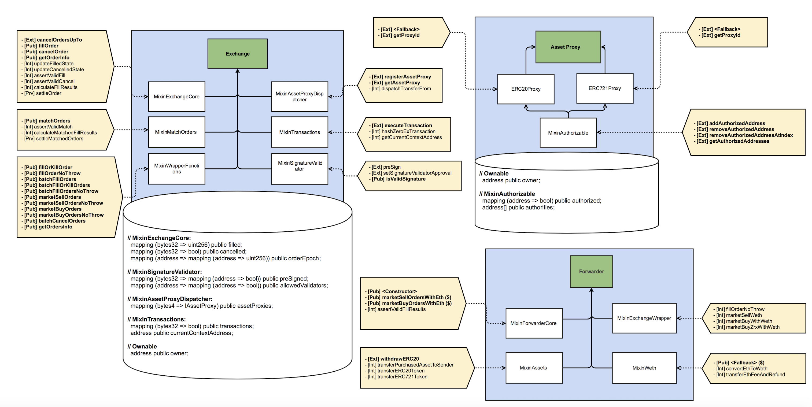
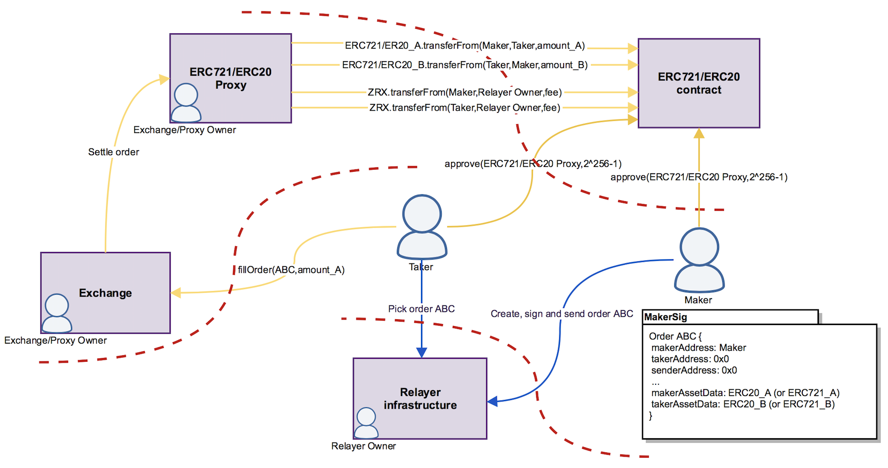
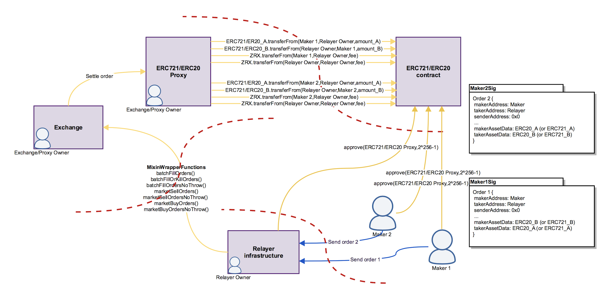
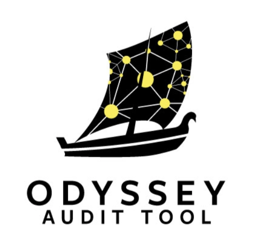

# 0x v2.0 Audit

 

<!-- Don't remove this -->
<!--59bcc3ad6775562f845953cf01624225-->
<!-- Don't remove this -->

## 1 Summary

From July 23, 2018 to September 10, 2018 ConsenSys Diligence conducted a security audit of the 0x Project's [second major iteration](https://github.com/ConsenSys/0x_audit_2018-07-23) of their contract system. The findings and recommendations are presented here in this report.

### 1.1 Audit Dashboard

________________

 

#### Audit Details
* **Project Name:** 0x 2.0
* **Client Name:** 0x
* **Client Contact:** Will Warren, Amir Bandeali
* **Auditors:** Suhabe Bugrara, Gerhard Wagner, John Mardlin, Steve Marx, Micah Dameron 
* **GitHub :** https://github.com/ConsenSys/0x_audit_2018-07-23
* **Languages:** Solidity, TypeScript, JavaScript
* **Date:** 2018-07-23 to 2018-09-10

#### Number of issues per severity

<%= issue_overview %>

________________

### 1.2 Audit Goals

The focus of the audit was to verify that the smart contract system is secure, resilient and working according to its specifications. The audit activities can be grouped in the following three categories:  

**Security:** Identifying security related issues within each contract and within the system of contracts.

**Sound Architecture:** Evaluation of the architecture of this system through the lens of established smart contract best practices and general software best practices.

**Code Correctness and Quality:** A full review of the contract source code. The primary areas of focus include:

* Correctness 
* Readability 
* Sections of code with high complexity
* Improving scalability
* Quantity and quality of test coverage

### 1.3 System Overview 

#### Documentation

The following documentation was available to the audit team:

* The [Wiki](https://0xproject.com/wiki#) high level information on the 0x system contract system.
* The [Version 2 specifications](https://github.com/0xProject/0x-protocol-specification/blob/master/v2/v2-specification.md) detailed specifications of the entire contract system.
* Technical challenges around DEX design and how 0x is designed to overcome them [1](https://blog.0xproject.com/front-running-griefing-and-the-perils-of-virtual-settlement-part-1-8554ab283e97) and [2](https://blog.0xproject.com/front-running-griefing-and-the-perils-of-virtual-settlement-part-2-921b00109e21).

#### Scope

The audit focus was on the smart contract files, and test suites found in the following directories of the [0x-monorepo](https://github.com/0xProject/0x-monorepo/commit/a05b14e4d9659be1cc495ee33fd8962ce773f87f) repository: 

|  Directory | Commit hash | Commit date |
|----------|-------------|-------------|
| [packages/contracts/src/2.0.0/forwarder](https://github.com/0xProject/0x-monorepo/commit/a05b14e4d9659be1cc495ee33fd8962ce773f87f/packages/contracts/src/2.0.0/forwarder) [packages/contracts/src/2.0.0/protocol](https://github.com/0xProject/0x-monorepo/commit/a05b14e4d9659be1cc495ee33fd8962ce773f87f/packages/contracts/src/2.0.0/protocol) [packages/contracts/src/2.0.0/utils](https://github.com/0xProject/0x-monorepo/commit/a05b14e4d9659be1cc495ee33fd8962ce773f87f/packages/contracts/src/2.0.0/utils)  | a05b14e4d9659be1cc495ee33fd8962ce773f87f          | 23rd July 2018| 

#### Architecture 

The 0x audit scope does not include all of the components that can be found in a complete deployment. The MultiSig wallet and the token related contracts are out of scope. The in-scope items can be divided into the following three distinct parts:

* **Exchange:** The Exchange contracts contain the bulk of the business logic within 0x protocol. It is the entry point for filling orders, cancelling orders, executing transactions, validating signatures and registering new ERC Proxy contracts into the system.
* **Asset Proxy:** is responsible for decoding asset specific metadata contained within an order, performing the actual asset transfer and authorizing/unauthorizing Exchange contract addresses from calling the transfer methods.
* **Forwarder:** enables users to buy assets (ERC20 or ERC721 tokens) with ETH. It removes the required knowledge of WETH and allowances. 

 

  
### 1.4 Key Observations

We found the quality of the codebase to be very high, which is particularly appreciated when approaching a complex protocol. In particular: 

* The specification documents are thorough, and well written. The diagrams of the system's interactions help to visualize the system. 
* The code is well commented, particularly in sections where it is most needed to understand the developer's intent.
* The organization of the contract repository is thoughtful and consistent. For example, the names of Solidity `contract`s which are inherited but not deployed are differentiated with the prefix `Mixin_`. Interfaces are prefixed with `M_`.

Relative to the v1 version of the system, the v2 updates introduce features which significantly improve the user experience, but also introduce many new edge cases, which directly resulted in some critical issues. These features include:

* Support for multiple `SignatureType`s, especially `Caller`, which was unique in not using the `orderHash` to verify an order, thus making it independent of the order's properties. See section 3.2 for more information on the resulting issue. 
* Enabling a 3rd party to call Exchange functions on behalf of a user. See section 3.1 for the resulting issue, and remediations.
* The generally high level of complexity, and possibly execution paths, make it difficult to test all possible edge cases. A number of untested behaviours were identified.

### 1.5 Recommendations  

* **Test coverage is incomplete:** Any contract system that is used on the main net should have as a minimum requirement a 100% test coverage.

* **Fix all issues:** We recommend addressing all the issues listed in the sections below, at the very least the ones with severity Critical, Major and Medium. All issues have also been created in a separate [audit repository](https://github.com/ConsenSys/0x_audit_2018-07-23/).

## 2 Issue Overview  

The following table contains all the issues discovered during the audit. The issues are ordered based on their severity. More detailed description on the levels of severity can be found in Appendix 2. The table also contains the Github status of any discovered issue.

<%= issue_list %>

## 3 Issue Detail  

<%= issues_markdown %>

## 4 Threat Model

The creation of a Threat Model is beneficial when building smart contract systems as it helps to understand the potential security threats, assess risk, and identify appropriate mitigation strategies. This is especially useful during the design and development of a contract system as it allows to create a more resilient design which is more difficult to change post-development. 

A Threat Model was created during the audit in order to analyze the attack surface of the contract system and to focus review and testing efforts on key areas that a malicious actor would likely also attack. It consists of two parts a high level design diagram that help to understand the attack surface and a list of threats that exist for the contract system. 

The 0x contract system enables a fairly flexible DEX protocol that allows for several variants on how relayers and traders can interact with the system. The following Threat Model is an abstraction of the current system and has been compiled based on architecture and design specifications. It does not claim completeness and can be considered as a complementary analysis type to the manual code review and automated tool analysis. 

### 4.1 Overview 

The scope of the Threat Model is to analyze the 0x protocol based on the two primary relayer strategies Open Orderbook and Matcher. Other strategies such as the Quote Provider and the Reserve Manager have been considered for the analysis yet they do not have significantly different security properties than the primary relayer strategies. 

**Open Orderbook**

 

**Matcher**

 

**System components:**

The 0x system has multiple components that are either deployed and maintained by 0x or by a third parties. 

* Exchange: See chapter [1.3 System Overview](#13-system-overview) 
* Asset Proxy: See chapter [1.3 System Overview](#13-system-overview) 
* ERC20/ERC721 contracts: hold the token balance.
* Relayer infrastructure: this can be a composed of centralized and decentralized components.  

**Assets:**

Assets need to be protected as potential threats could materialize in considerable loss for the Actors in the system.

* ERC20/ERC721 tokens: owned by Traders and Relayers 
* Exchange/Proxy Owner private keys: tied to a Gnosis MultiSig wallet   

**Actors:**

Actors that take part in the 0x protocol:

* Maker: creates and signs an order to trade token A for token B 
* Taker: takes an order and trade token B for token A  
* Trader: Maker or Taker
* Relayer Owner: aggregate orders, provide liquidity and take part in trades as a Maker or Taker 
* Exchange/Proxy Owner: add and remove authorities to the Asset Proxy and register and unregister an Asset Proxy in the Exchange 
* Miners: include order processing and settlement transactions in new blocks 

### 4.2 Threat Analysis 

The following table contains a list of identified threats that exist in the 0x protocol

|  Threat | Relayer Strategy | Mitigation | 
|-------------|-------------|-------------|
| The Exchange/Proxy Owner gets hacked and the private keys get exposed. The Traders and Relayers could lose all of their ERC20/ERC721 tokens that they have approved. | Open Orderbook, Matcher | A newly added AssetProxyOwner has a two weeks time-lock for approving new transactions. It gives Traders and Relayers the chance to remove their allowances in case an untrusted address is authorized within an AssetProxy. |
| The Exchange/Proxy Owner makes unauthorized transfers and misappropriates the assets. The Traders and Relayers could lose all of their ERC20/ERC721 tokens that they have approved. | Open Orderbook, Matcher | At least the majority of the AssetProxyOwners need to collude in order to add a new AssetProxy |
| Miners and other Traders could front-run any order that have no Taker specified.  | Open Orderbook | Traders can choose a relayer with a Matcher strategy to prevent front-running attacks. Traders need to trust the chosen Relayers to match orders fairly.|
| Relayers could front-run orders that have no Taker specified. | Matcher | Traders can chose a Relayer that uses an Open Orderbook strategy |
| Relayers could censor orders and prevent Traders from participating | Matcher | Traders can switch to other Relayers |

## 5 Tool based analysis 

The issues from the tool based analysis have been reviewed and the relevant issues have been listed in chapter 3 - Issues. 

### 5.1 Mythril 

Mythril is a security analysis tool for Ethereum smart contracts. It uses concolic analysis to detect various types of issues. The tool was used for automated vulnerability discovery for all audited contracts and libraries. More details on Mythril's current vulnerability coverage can be found [here](https://github.com/ConsenSys/mythril/wiki).

The raw output of the Mythril vulnerability scan can be found [here](./static-content-project-specific/mythril_output.md).

### 5.2 Solhint 

This is an open source project for linting Solidity code. The project provides both Security and Style Guide validations. The issues of Solhint were analyzed for security relevant issues only. It is still recommended to use Solhint during development to improve code quality while writing smart contracts. 

The raw output of the Solhint vulnerability scan can be found [here](..). 

### 5.3 Surya
Surya is an utility tool for smart contract systems. It provides a number of visual outputs and information about structure of smart contracts. It also supports querying the function call graph in multiple ways to aid in the manual inspection and control flow analysis of contracts.

A complete list of functions with their visibility and modifiers can be found [here](...).

### 5.4 Odyssey 

Odyssey is an audit tool that acts as the glue between developers, auditors and tools. It leverages Github as the platform for building software and aligns to the approach that quality needs to be addressed as early as possible in the development life cycle and small iterative security activities spread out through development help to produce a more secure smart contract system.
In its current version Odyssey helps to better communicate audit issues to development teams and to successfully close them.

## 6 Test Coverage Measurement

<!-- 

Testing is implemented using the YYY. XXX tests are included in the test suite and they all pass.

The [Solidity-Coverage](https://github.com/sc-forks/solidity-coverage) tool was used to measure the portion of the code base exercised by the test suite, and identify areas with little or no coverage. Specific sections of the code where necessary test coverage is missing are included in chapter 3 - Issues.

It's important to note that "100% test coverage" is not a silver bullet. Our review also included a inspection of the test suite, to ensure that testing included important edge cases.

The state of test coverage at the time of our review can be viewed in html rendered from the Github repo, or by opening the `index.html` file from the [coverage report](...) directory in a browser.

-->

## Appendix 1 - File Hashes

Find the full list of files in the scope including SHA1 hashes in the [Surya tool directory](./tool-output/surya/report.md). 

## Appendix 2 - Severity 

### A.2.1 - Minor

Minor issues are generally subjective in nature, or potentially deal with topics like "best practices" or "readability".  Minor issues in general will not indicate an actual problem or bug in code.

The maintainers should use their own judgment as to whether addressing these issues improves the codebase.

### A.2.2 - Medium

Medium issues are generally objective in nature but do not represent actual bugs or security problems.

These issues should be addressed unless there is a clear reason not to.

### A.2.3 - Major

Major issues will be things like bugs or security vulnerabilities.  These issues may not be directly exploitable, or may require a certain condition to arise in order to be exploited.

Left unaddressed these issues are highly likely to cause problems with the operation of the contract or lead to a situation which allows the system to be exploited in some way.

### A.2.4 - Critical

Critical issues are directly exploitable bugs or security vulnerabilities.

Left unaddressed these issues are highly likely or guaranteed to cause major problems or potentially a full failure in the operations of the contract.

## Appendix 3 - Disclosure

ConsenSys Diligence (“CD”) typically receives compensation from one or more clients (the “Clients”) for performing the analysis contained in these reports (the “Reports”). The Reports may be distributed through other means, including via ConsenSys publications and other distributions.

The Reports are not an endorsement or indictment of any particular project or team, and the Reports do not guarantee the security of any particular project. This Report does not consider, and should not be interpreted as considering or having any bearing on, the potential economics of a token, token sale or any other product, service or other asset. Cryptographic tokens are emergent technologies and carry with them high levels of technical risk and uncertainty. No Report provides any warranty or representation to any Third-Party in any respect, including regarding the bugfree nature of code, the business model or proprietors of any such business model, and the legal compliance of any such business. No third party should rely on the Reports in any way, including for the purpose of making any decisions to buy or sell any token, product, service or other asset. Specifically, for the avoidance of doubt, this Report does not constitute investment advice, is not intended to be relied upon as investment advice, is not an endorsement of this project or team, and it is not a guarantee as to the absolute security of the project. CD owes no duty to any Third-Party by virtue of publishing these Reports.

PURPOSE OF REPORTS The Reports and the analysis described therein are created solely for Clients and published with their consent. The scope of our review is limited to a review of Solidity code and only the Solidity code we note as being within the scope of our review within this report. The Solidity language itself remains under development and is subject to unknown risks and flaws. The review does not extend to the compiler layer, or any other areas beyond Solidity that could present security risks. Cryptographic tokens are emergent technologies and carry with them high levels of technical risk and uncertainty.

CD makes the Reports available to parties other than the Clients (i.e., “third parties”) -- on its Github account (https://github.com/ConsenSys). CD hopes that by making these analyses publicly available, it can help the blockchain ecosystem develop technical best practices in this rapidly evolving area of innovation.

LINKS TO OTHER WEB SITES FROM THIS WEB SITE You may, through hypertext or other computer links, gain access to web sites operated by persons other than ConsenSys and CD. Such hyperlinks are provided for your reference and convenience only, and are the exclusive responsibility of such web sites' owners. You agree that ConsenSys and CD are not responsible for the content or operation of such Web sites, and that ConsenSys and CD shall have no liability to you or any other person or entity for the use of third party Web sites. Except as described below, a hyperlink from this web Site to another web site does not imply or mean that ConsenSys and CD endorses the content on that Web site or the operator or operations of that site. You are solely responsible for determining the extent to which you may use any content at any other web sites to which you link from the Reports. ConsenSys and CD assumes no responsibility for the use of third party software on the Web Site and shall have no liability whatsoever to any person or entity for the accuracy or completeness of any outcome generated by such software.

TIMELINESS OF CONTENT The content contained in the Reports is current as of the date appearing on the Report and is subject to change without notice. Unless indicated otherwise, by ConsenSys and CD. 

